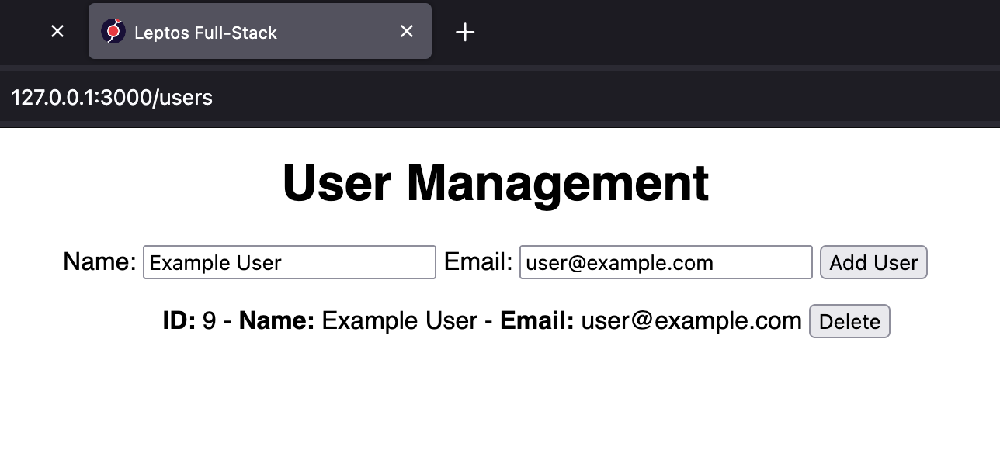

# Leptos Full Stack

Example Rust full-stack built with Leptos, Axum, and SQLx. 🧱

List, add, and delete users from an SQLite database.

For PostgreSQL see [Leptos Full Stack (PostgreSQL Version)](https://github.com/hexensemble/leptos-full-stack-postgresql).

 

**Download:** https://github.com/hexensemble/leptos-full-stack/releases

Pre-compiled for Linux.

 

Run the server binary `./leptos-full-stack` then head to 127.0.0.1:3000 in your browser.

 

**Features:**

- Full-Stack with Leptos
- Rust from front to back
- Axum REST API integration
- SQLite database
- SQLx for database integration
- CORS configured
- Reactive user interface
- Simple form handling
